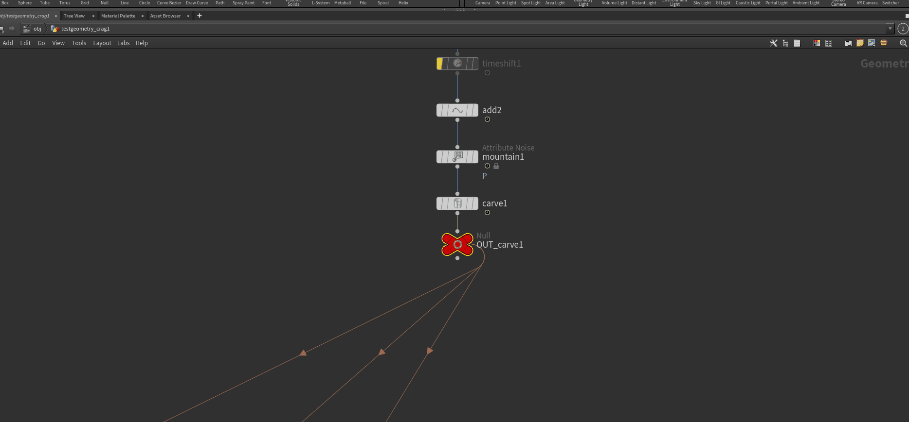

# Houdini Graph Shortcut

This tool simplifies the process of arranging and navigating the network view in Houdini by using shortcuts. It's designed to enhance your workflow and save you time.

## Feature

Create 'Null' nodes with a simple combination of a left-click and the 'X' key. There is many feature for the creation try it :)


Create 'Object Merge' node with a simple combination of a middle-click and the 'X' key.


Additionally, navigating through your node graph has never been easier. By double-clicking on a connection, you can seamlessly move through the graph. 



For those who frequently use 'Null' nodes, our tool offers a neat feature where you can create an 'Object Merge' by double-clicking on a 'Null'. This function is perfect for those looking to maintain organization and efficiency in their node structures. 


By pressing 'X' along with a middle-click, you can instantly create a connection between 'Null' and 'Object Merge' nodes, helping you keep your workspace tidy and organized.


## Future feature

Some features are planned for the future, if you have some idea, please contact me :)

- Smart naming
  - IA génerated ?

- Color change automaticaly with the purpose of the node: 
  -  if the output of the null is as connected the null is purple
  -  if it has no output it's in red

- Clean graph Node :
  - Multi selection connections

- Object merge :
  - filter search for only null (and the purpose of the null)

## Installation

1. Copy "copy_to_package.json" into your user packages folder.
**Example:**
```
C:\Users\avgilles\Documents\houdini20.0\packages\
```

2. Change the line with the path to the directory where the repo was saved.

```Json
"value": "C:/github/houdini_graph_shortcut",
```
3. Change the python3.9libs folder with the version of Python you are using.
**Example:**
if your Houdini uses Python 3.10, replace the folder with
python3.10libs
You have completed the installation, enjoy !
